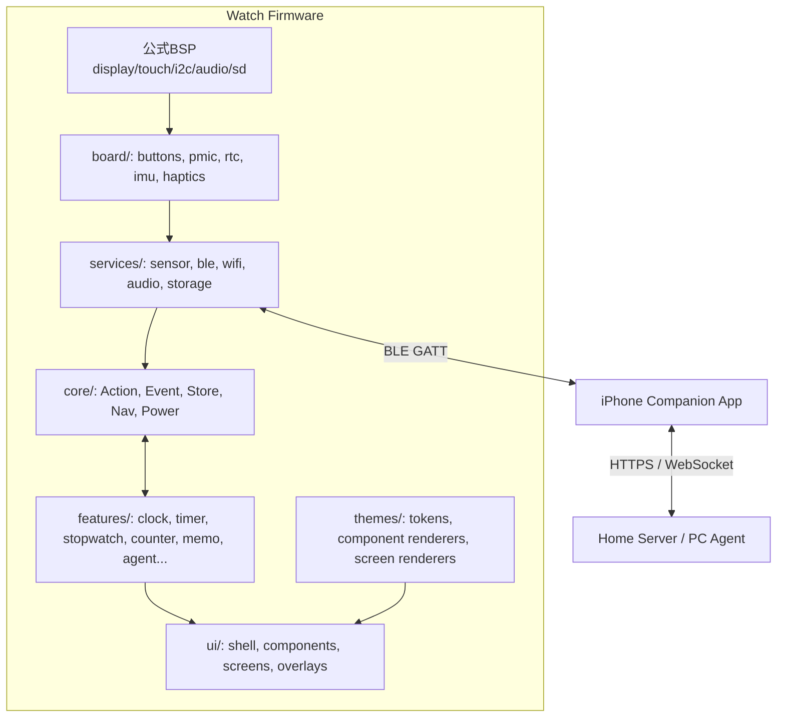
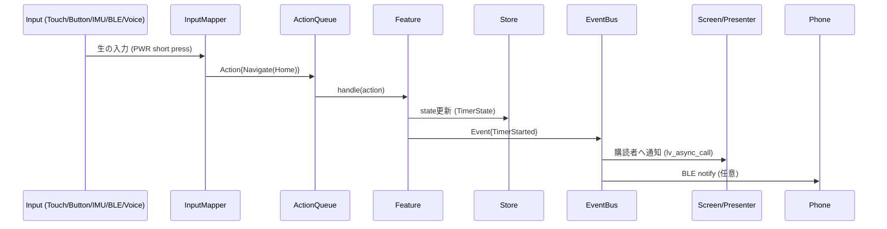
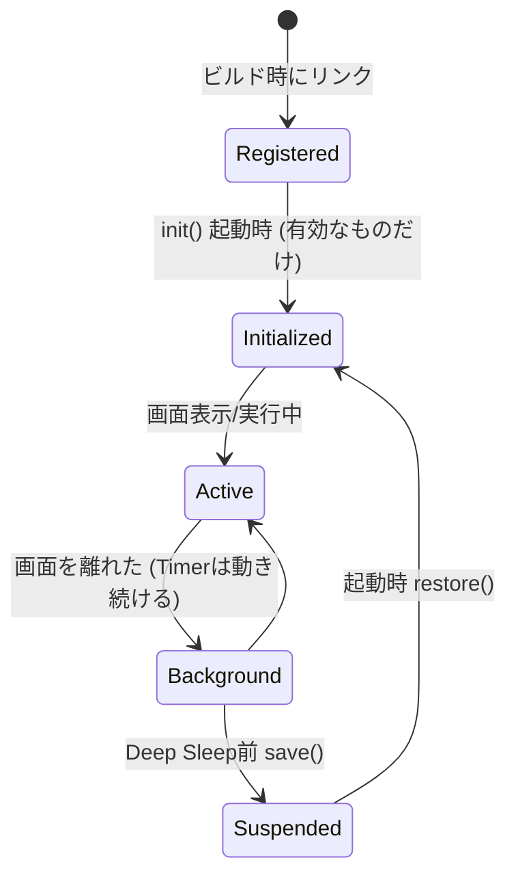
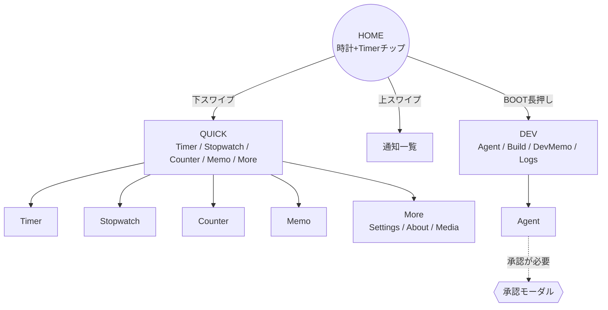
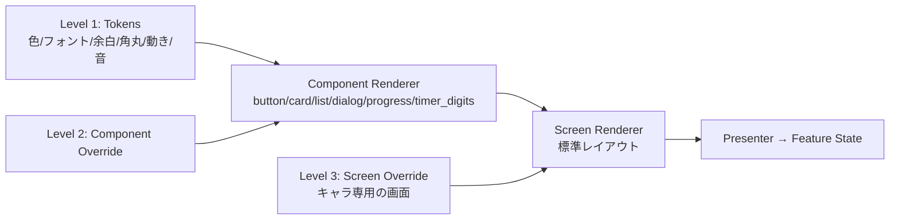
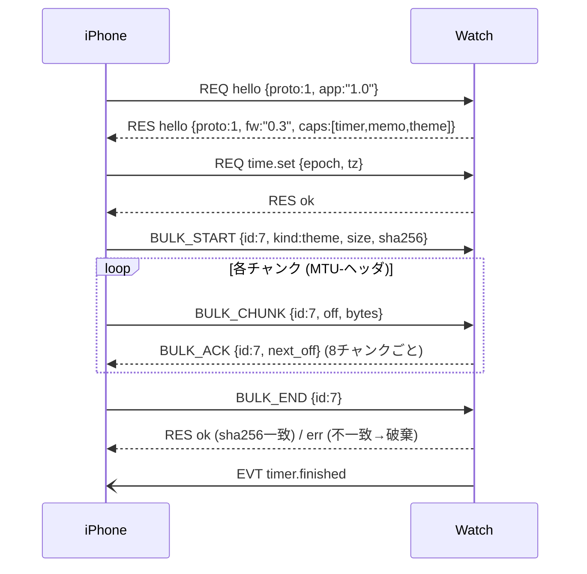
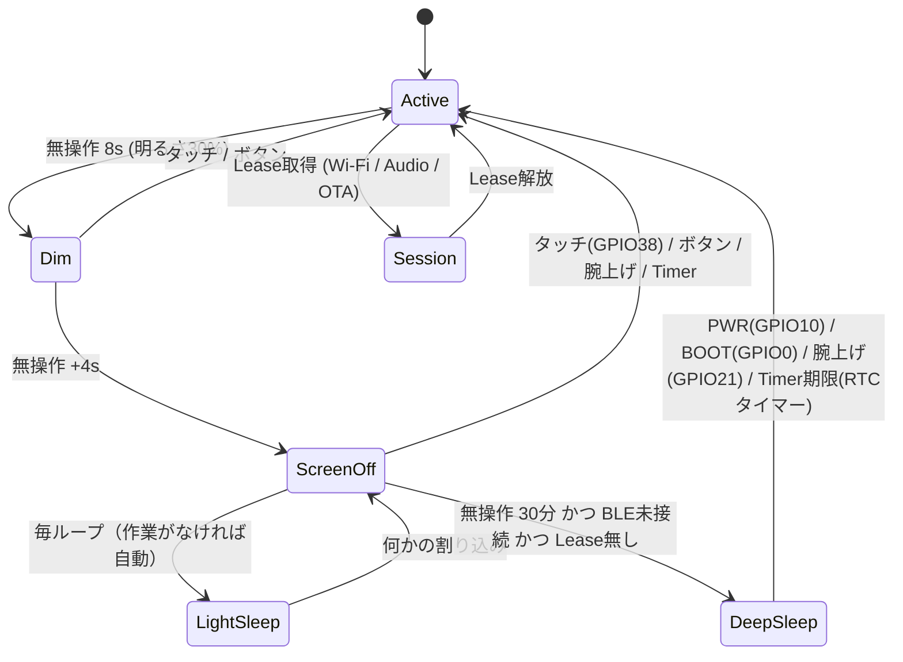

# Waveshare ESP32-S3-Touch-AMOLED-2.06 スマートウォッチ 設計・実装計画 v1

> この計画は公式Wiki / 公式GitHub (`waveshareteam/ESP32-S3-Touch-AMOLED-2.06`) / 公式BSP (`waveshare/esp32_s3_touch_amoled_2_06`) / 公式回路図 (`Schematic-V1.0.pdf`) / 公式サンプルコードを読んで作成した。
> 【確認済】は資料やコードで確認できたもの、【要実機】は実機で測らないと決められないもの、【推測】は私の判断。

---

## 0. 結論（先に読む）

| 決めたこと | 内容 | 理由 |
|---|---|---|
| フレームワーク | **ESP-IDF 5.5.x**（Arduinoは使わない） | 公式BSP v2・公式サンプルの本流がESP-IDF。電源やBLE、OTAを細かく制御できる |
| 言語 | **C++17**（Core/Feature/UI）＋ **C**（BSP glue） | 公式サンプルもC/C++混在（`01_AXP2101`はC++の`XPowersLib`） |
| UI | **LVGL 9.5 ＋ `esp_lvgl_port` ＋ 公式BSP** | 公式の`02_lvgl_demo_v9`の`idf_component.yml`がLVGL 9.5.0を指定 |
| BLE | **NimBLE** | Bluedroidよりメモリが少ない |
| Feature | **静的リンク＋Registryでオン/オフ** | 実行時プラグインは個人開発には重すぎる |
| Theme | **Token → Component → Screen Renderer の3段階** | 「色を変えるだけ」でも「全部自由」でもない中間を取る |
| 通信 | **Watch ⇄(BLE)⇄ iPhone ⇄(HTTPS/WS)⇄ Home Server** | 時計単体のWi-Fiは電池を食う。Wi-Fiは同期やOTAのときだけ |
| スリープ | **Light Sleepが基本。Deep Sleepは「電源オフに近い状態」として扱う** | 回路図上、Touch割り込み(GPIO38)とRTC割り込み(GPIO39)はDeep Sleepの復帰に使えない（下で説明） |

一番大事な方針：**最初の3か月は「時計＋Timer＋Memo＋BLE設定同期」だけ完成させる。** そのあとAgentやキャラThemeに広げる。

---

## A. Hardware Analysis（回路図・BSP・サンプルで確認）

### A-1. 部品

| 部品 | 型番 | バス | 備考 |
|---|---|---|---|
| SoC | ESP32-S3R8 | – | PSRAM 8MB Octal 内蔵【確認済】 |
| Flash | **GD25Q256EYIGR（32MB）** | QSPI | 回路図で確認。ただし公式サンプルの`sdkconfig`は16MB設定【確認済】→ 理由は下 |
| 画面 | 2.06" AMOLED 410×502、CO5300 | QSPI | BSPは`esp_lcd_sh8601`ドライバで動かしている【確認済】 |
| タッチ | FT3168 | I2C 0x38 | BSPは`esp_lcd_touch_ft5x06`で動かしている【確認済】 |
| PMIC | AXP2101 | I2C 0x34 | 公式は`XPowersLib`を使用【確認済】 |
| IMU | QMI8658C | I2C **0x6B** | 回路図でSA0=GND→0x6B表記【確認済】 |
| RTC | PCF85063ATL | I2C 0x51 | 32.768kHz水晶付き |
| マイクADC | ES7210 ＋ マイク2個 | I2C + I2S | |
| コーデック | ES8311 ＋ アンプNS4150B | I2C + I2S | アンプはGPIO46でON/OFF |
| microSD | – | SDMMC 1bit（BSP） | 配線はSPI名だがBSPはSDMMCで使う |
| モーター | パッドP1/P2のみ | GPIO18→トランジスタ | **振動モーター用の配線がある**【確認済】。モーター本体の同梱は【要実機】 |

### A-2. GPIO表（回路図のピン表を目視確認）

| GPIO | 用途 | RTC GPIO? | 意味 |
|---|---|---|---|
| 0 | BOOTボタン（押すとLOW） | ○ | Deep Sleep復帰に使える |
| 1/2/3/17 | SD (CMD/CLK/D0/CS) | | |
| 4–7, 11, 12 | QSPI画面 (SIO0-3, SCL, CS) | | |
| 8 | 画面リセット | | |
| 9 | タッチリセット | | |
| **10** | **PWRボタン（SYS_OUT）押すとHIGH** | ○ | **PWRボタンでDeep Sleepから復帰できる** |
| 13 | **LCD_TE（テアリング信号）** | | BSPは未使用。チラつき対策に使える |
| 14/15 | I2C SCL/SDA（全センサ共通） | | **全部同じバス**→1本を共有する設計が必要 |
| 16, 40, 41, 42, 45 | I2S (MCLK/DSDIN/SCLK/ASDOUT/LRCK) | | |
| 18 | 振動モーター | | |
| 19/20 | USB D-/D+ | | ネイティブUSB（ログ・書き込み） |
| **21** | **IMU INT1** | ○ | **腕を上げたらDeep Sleepから復帰**ができる |
| 38 | タッチ割り込み | × | **Light Sleepの復帰のみ** |
| 39 | RTC割り込み | × | **Light Sleepの復帰のみ** |
| 43/44 | UART0 | | |
| 46 | アンプON/OFF | | |

### A-3. 回路図から分かった重要な点（設計に効くもの）

1. **PWRボタンは2つにつながっている。** AXP2101の`PWRON`と、MOSFET経由でGPIO10。
   - 短押し → GPIO10で読む（押すとHIGH）
   - 長押し → AXP2101がハードウェアで電源を切る（AXP設定で秒数を変えられる）
   - 公式の「PWRは拡張I/O」という説明は他機種の情報が混ざっている可能性がある。**この基板ではGPIO10**。
2. **AXP2101のIRQ線はESP32につながっていない。**（回路図でEXIO5/AXP_IRQに×、BSPも`PMU_INTERRUPT_PIN=-1`）→ 充電の検出や電池残量は**I2Cで定期的に読む**（例：Activeのとき5秒ごと、Sleep中は起きたときだけ）。
3. **画面のパネル電源`DSI_PWR_EN`はAXP2101のALDO2から来ている。** → 長く消すときはALDO2を切ってパネルの電源ごと落とせる【要実機：再初期化にかかる時間】。
4. **Deep Sleepから復帰できるのはBOOT(GPIO0)、PWR(GPIO10)、IMU(GPIO21)、タイマーだけ。** タッチで画面を起こすにはLight Sleepである必要がある。
   → 「画面OFF中もタッチで起きる」のがLight Sleep、「PWRボタンか手首を上げないと起きない」のがDeep Sleep、と2段階にする。
5. **Flash 32MB問題。** ESP32-S3で16MBを超えるQuad Flashを使うには、ESP-IDFの実験的オプション（32bitアドレス）が必要。公式サンプルが16MB設定なのはたぶんこのため【推測】。
   → **最初は16MBとして使う。** 16MBあればアプリ×2（OTA）＋アセットに十分。32MB全部を使うのはPhase 10で検討する。
6. **I2Cは1本を全員で共有。** Touch・RTC・IMU・PMIC・Codec×2がGPIO14/15を使う。BSPの`bsp_i2c_get_handle()`のバスに`i2c_master_bus_add_device`で全部つなぐ。**I2Cにアクセスするタスクを減らし**、タッチ読み取り（LVGL task）以外は`sensor_service`タスク1つにまとめる。

### A-4. 公式BSP・サンプルの事実

| 項目 | 値 |
|---|---|
| BSP | `waveshare/esp32_s3_touch_amoled_2_06` v2系（`idf: >=5.3`） |
| BSP依存 | `esp_lvgl_port ^2`、`lvgl >=8,<10`、`esp_lcd_sh8601`、`esp_lcd_touch_ft5x06`、`esp_codec_dev ~1.5` |
| LVGLバッファ（BSP初期値） | 410×**20**行（`CONFIG_BSP_LCD_RGB_BOUNCE_BUFFER_HEIGHT`=20）、**PSRAM**に確保（`buff_spiram=true`）【確認済】→ 小さめなので`bsp_display_start_with_config()`で調整する【要実機】 |
| 明るさ | `bsp_display_brightness_set(percent)` → 内部でCO5300の`0x51`コマンド |
| BSPの機能フラグ | Display/Touch/Audio/SD=1、**Buttons/IMU=0** → ボタンとIMUは自分で書く |
| 注意 | サンプルの`dependencies.lock`はLVGL 9.2.0 / BSP 1.0.3のまま古い。**`idf_component.yml`の方（9.5.0）を正とする** |
| 座標 | CO5300は描画範囲のx/yが**偶数**である必要あり → `rounder_cb`が必要（BSPが対応済みか【要実機】） |

### A-5. 公式サンプルから使えるもの

| サンプル | 使う部分 |
|---|---|
| `01_AXP2101/port_axp2101.cpp` | `XPowersPMU`の初期化、I2C read/writeのつなぎ方 → `services/pmic`にほぼそのまま |
| `02_lvgl_demo_v9/main` | `bsp_display_start()` → `bsp_display_lock()` → 画面作成の流れ |
| `03_esp-brookesia/main.cpp` | **他のタスクからLVGLを触るときの`bsp_display_lock`の使い方**。ただしESP-Brookesia本体はUIフレームワークとして重いので**採用しない** |
| `04_Immersive_block` | QMI8658の初期化と読み取り |
| `05_Spec_Analyzer` | `bsp_audio_codec_microphone_init()`→ES7210から録音 |
| `06_videoplayer` | `bsp_sdcard_mount()`、スピーカー再生 |
| `waveshare/qmi8658` | `qmi8658_enable_wake_on_motion(dev, threshold)`がある → 腕を上げて起動に使う |

---

## B. Architecture（全体）



### タスク構成（FreeRTOS）

| タスク | Core | 優先度 | 役割 |
|---|---|---|---|
| `lvgl` (esp_lvgl_portが作る) | 1 | 4 | 描画・タッチ |
| `app` | 1 | 5 | Actionキュー処理、Feature、Store更新 |
| `sensor` | 0 | 3 | I2C（PMIC/RTC/IMU）、ボタン |
| `ble` (NimBLE host) | 0 | – | BLE |
| `audio` | 0 | 6 | 録音/再生のときだけ作る |

**ルール：LVGLを触っていいのは`lvgl`タスク内か`bsp_display_lock()`の中だけ。** FeatureはLVGLを知らない。

---

## C/D. Core Architecture（Action / Event / State）



- **Action = 「やってほしいこと」**（命令）。入力元はどこでもいい。
- **Event = 「起きたこと」**（結果）。Featureが出す。
- **State = Featureごとに持つ**。巨大な1つのStoreにはしない。
- UIは`Event`を受けたら`lv_async_call`でLVGLタスクに渡して描き直す。

### コード例

```cpp
// core/action.hpp
enum class ActionType : uint16_t {
  Navigate, Back, Home,
  TimerStart, TimerStop, TimerReset,
  StopwatchToggle, CounterAdd,
  MemoCreate, MemoRecordStart, MemoRecordStop,
  AgentSend, AgentApprove, AgentReject,
  SetBrightness, SetTheme,
};
enum class ActionSource : uint8_t { Touch, Button, Imu, Voice, Phone, System };

struct Action {
  ActionType type;
  ActionSource source;
  uint32_t arg0 = 0;          // 秒数・Route・IDなど小さい値
  const char* text = nullptr; // 文字列はPSRAMのプールを指す（コピーしない）
};

// core/event.hpp
enum class EventType : uint16_t {
  TimerStarted, TimerTick, TimerFinished,
  MemoSaved, AgentStatusChanged,
  BatteryChanged, ChargingChanged, BleConnChanged,
  PowerStateChanged, ThemeChanged, RouteChanged,
};
struct Event { EventType type; uint32_t arg0 = 0; };

// core/runtime.cpp
static QueueHandle_t s_actions;      // 深さ16
void dispatch(const Action& a) { xQueueSend(s_actions, &a, 0); }

static void app_task(void*) {
  Action a;
  for (;;) {
    TickType_t wait = features::next_deadline_ticks();   // Timerの次の期限まで寝る
    if (xQueueReceive(s_actions, &a, wait)) {
      power::kick_activity(a.source);                    // 入力があったら画面を延長
      if (!nav::handle(a)) features::handle(a);
    }
    features::tick(esp_timer_get_time() / 1000);
  }
}
```

```cpp
// core/event_bus.hpp — 固定長、mallocなし
using EventHandler = void (*)(const Event&, void* ctx);
struct Subscription { EventType type; EventHandler fn; void* ctx; };
class EventBus {
 public:
  bool subscribe(EventType t, EventHandler fn, void* ctx);
  void unsubscribe(EventHandler fn, void* ctx);
  void publish(const Event& e);   // appタスク内で同期呼び出し
 private:
  std::array<Subscription, 48> subs_{};
};
```

**なぜこうするか：** 汎用のpub/subにすると「どこで何が起きたか」が追えなくなる。Actionは1本のキューで順番に処理、Eventは固定の配列で同期的に呼ぶ、だけにしてデバッグしやすくする。

---

## E. Feature Architecture



```cpp
// core/feature.hpp
struct FeatureContext { EventBus& bus; Storage& storage; PowerManager& power; Clock& clock; };

struct FeatureDescriptor {
  const char* id;                 // "timer"
  uint32_t capabilities;          // HasHomeWidget | HasQuickTile | NeedsAudio ...
  void (*init)(FeatureContext&);
  bool (*handle)(const Action&, FeatureContext&);
  uint32_t (*next_deadline_ms)(); // 次に起きる必要がある時刻 (0=なし)
  void (*save)(Storage&);         // Deep Sleep前
  void (*restore)(Storage&);
};

// features/registry.cpp（CMakeとKconfigで出し入れ）
extern const FeatureDescriptor kClock, kTimer, kStopwatch, kCounter, kMemo;
const FeatureDescriptor* const kFeatures[] = {
  &kClock, &kTimer, &kStopwatch, &kCounter,
#if CONFIG_FEATURE_MEMO
  &kMemo,
#endif
};
```

### Timerの例（Featureは画面を持たない）

```cpp
// features/timer/timer.cpp
namespace { struct { bool running; int64_t end_ms; uint32_t dur_s; } st; }

static bool handle(const Action& a, FeatureContext& c) {
  switch (a.type) {
    case ActionType::TimerStart:
      st = {true, c.clock.now_ms() + a.arg0 * 1000LL, a.arg0};
      c.bus.publish({EventType::TimerStarted, a.arg0});
      return true;
    case ActionType::TimerStop:
      st.running = false; c.bus.publish({EventType::TimerFinished, 0}); return true;
    default: return false;
  }
}
static uint32_t next_deadline() { return st.running ? (uint32_t)st.end_ms : 0; }
```

- 画面は`ui/screens/timer`、Homeの小さい表示は`ui/widgets/timer_chip`、Quickのボタンは`ui/quick/tiles`がそれぞれ**同じEventを購読**する。
- **時刻は`esp_timer`ではなく「終了時刻」を持つ。** スリープしても時刻がずれない。Light Sleepの復帰は`esp_sleep_enable_timer_wakeup(next_deadline)`。

### 新しいFeatureを足すとき触る場所

1. `components/features/<name>/` を作る（descriptor、state、handle）
2. `ActionType`/`EventType`に必要なものを足す
3. `registry.cpp`に1行、Kconfigに1項目
4. 画面が要るなら`ui/screens/<name>`
5. Phoneから設定するなら`protocol/schema`にキーを足す

---

## F. UI Architecture

```text
Feature State ──Event──▶ Presenter(画面ごと) ──▶ UI Components(ui_button等) ──▶ LVGL 9.5
                                         ▲
                                     Theme(Tokens/Renderers)
```

- **自作UIフレームワークは作らない。** LVGLのウィジェットを薄く包んだComponentを10個くらい作るだけ。
- 画面は「作る(create)・更新(update)・壊す(destroy)」の3関数。画面を離れたら`lv_obj_delete`してメモリを返す（Homeだけは常に残す）。

```cpp
// ui/screen.hpp
struct ScreenDescriptor {
  Route route;
  lv_obj_t* (*create)(lv_obj_t* parent, const Theme&);
  void (*on_event)(lv_obj_t* root, const Event&);  // LVGLタスク内で呼ばれる
  void (*destroy)(lv_obj_t* root);
};
```

### 描画の設定（このボード向け）

| 項目 | 初期値 | 理由 |
|---|---|---|
| 色 | RGB565、`swap_bytes`はBSP設定に従う | |
| バッファ | BSP初期値（20行・PSRAM）で動かしてから、**410×100行×2枚・内部RAM**（約164KB）と比較 | 内部RAMの方が速いがRAMを食う。フル画面（約402KB）は内部RAMに入らない |
| 代案 | フル画面2枚をPSRAMに | アニメが多いキャラThemeで試す【要実機：fps比較】 |
| テアリング | GPIO13(TE)を使うか検討 | BSPは未使用。スクロールでチラつくなら導入 |
| 更新周期 | `LV_DEF_REFR_PERIOD` 16ms→**通常33ms** | 30fpsで十分。電池優先 |
| 黒背景 | **基本テーマは黒背景** | AMOLEDは黒が光らない＝電池が持つ |

---

## G. Navigation



- トップは**Homeだけ**。Quick/Devは「呼び出す画面」。こうすると「今どこ？」にならない。
- 戻る：**PWR短押し = 1つ戻る、Homeにいるときは画面OFF**。画面の左端から右へスワイプでも戻る。
- 画面スタックは最大4段。超えたら一番古いのを捨てる。

```cpp
class Navigator {
 public:
  void push(Route r); void replace(Route r); void pop(); void pop_to_home();
  void present_modal(Route r); void dismiss_modal();
  Route current() const;
 private:
  etl::vector<Route, 4> stack_;   // 固定長（ETLか自前）
  std::optional<Route> modal_;
};
```

### 物理ボタン（初期割り当て、Phoneから変更可）

| 操作 | BOOT (GPIO0) | PWR (GPIO10) |
|---|---|---|
| 短押し | 画面ごとの主アクション（Timer開始/停止、Stopwatch等） | 戻る / Homeで画面OFF |
| 長押し(0.8s) | DEV画面 | 電源メニュー |
| 長押し(AXP設定 6s) | – | ハード電源OFF（AXP2101） |
| 2回押し | Memo録音開始 | – |

ボタンは`sensor`タスクで10msポーリング＋GPIO割り込みで起こす。`espressif/button`コンポーネントを使う（短押し/長押し/2回押しが揃っている）。

---

## H. Design System / Theme



| Level | 何を変える | 必要なもの | 例 |
|---|---|---|---|
| 1 Token | 色・フォント・音・アイコン | `theme.yaml`（ビルド時にC++へ変換） | ダーク、高コントラスト |
| 2 Component | ボタンや数字の見た目 | Tokens＋Rendererを数個 | 丸ボタン、ネオン数字 |
| 3 Screen | 画面配置そのもの | 上＋対応するScreen Renderer | キャラが時計の横で動く |

```cpp
struct ThemeTokens {
  lv_color_t bg, surface, primary, on_primary, text, text_dim, danger;
  const lv_font_t *font_body, *font_title, *font_digits;
  uint8_t space_unit /*=8*/, radius_sm, radius_lg;
  uint16_t anim_fast_ms, anim_slow_ms;
  const SoundSet* sounds;
};
struct Theme {
  const char* id; uint16_t api_version;
  ThemeTokens tokens;
  const ComponentRenderers* components;              // nullptr = 標準
  const ScreenRenderer* const* screen_overrides;     // Routeごと, nullptr = 標準
  uint32_t required_capabilities;                    // 必要なFeature
};
```

- 足りないものは標準にフォールバック（Level 3 Themeが Memo画面を持っていなければ標準のMemo画面）。
- **ThemeはFeatureのコードを持たない。** Timerのロジックはどのテーマでも1つ。
- Design Systemとして最初に決める数字：基本余白8px、タップ領域は最小**64×64px**（410px幅で横に最大5個）、本文フォント24px、数字フォント96px、角丸16px。

---

## I. Asset System

| 種類 | 置き場所 | 形式 |
|---|---|---|
| 標準アイコン・標準フォント | アプリ内（flash rodata） | LVGL C配列（`lv_font_conv`/`LVGLImage.py`） |
| テーマ画像・キャラ | `assets`パーティション（LittleFS、約4MB） | LVGLバイナリ画像（RGB565A8）、`manifest.cbor`付き |
| 長い音声・大きいもの | microSD（任意） | WAV/PCM |

- 日本語フォントは**使う文字だけ**入れる（JIS第1水準＋UI文言 ≒ 3000字、24pxで約1MB）。
- Assetは`sha256`と`api_version`を確認し、だめなら標準テーマに戻す。

### パーティション案（16MBとして）

```csv
# Name,   Type, SubType, Offset,  Size
nvs,      data, nvs,     0x9000,  0x6000
otadata,  data, ota,     ,        0x2000
phy_init, data, phy,     ,        0x1000
ota_0,    app,  ota_0,   ,        4M
ota_1,    app,  ota_1,   ,        4M
assets,   data, littlefs,,        6M
storage,  data, littlefs,,        1900K
coredump, data, coredump,,        64K
```

---

## J. Phone Companion（Android 14）

> 2026-10-05 更新：ユーザーのスマホは **Android 14**。以下のiPhone前提の記述はAndroid向けに読み替える：Kotlin + Jetpack Compose、BLEは`BluetoothLeScanner`/`BluetoothGatt`（`BLUETOOTH_SCAN`/`BLUETOOTH_CONNECT`権限）、常駐は`connectedDevice`型のForeground Service、通知転送は`NotificationListenerService`、音楽操作は`MediaSessionManager`。ANCS/AMSは使わない。

（以下は旧iPhone版の記述）

- **SwiftUI＋CoreBluetooth**。最初は自分用なのでTestFlightかXcodeから直接入れる。
- iOSのBLEの制約：アプリがバックグラウンドでも「接続済みデバイスからの通知」では起きられる（`bluetooth-central` background mode＋State Restoration）。ただし**いつも動いているサーバーにはならない**【確認済の一般仕様、実機で挙動確認】。
- **iPhoneアプリ無しで使える標準機能もある**【要実機】：
  - **ANCS**（iPhoneの通知を時計に出す）
  - **AMS**（音楽の再生/停止/曲名）→ Media機能はこれでいける
  - **BLE HID**（音量ボタンとして見せる＝カメラのシャッター、PCにはキーボードとして見せる）

| 段階 | iPhoneアプリの機能 |
|---|---|
| J1 | ペアリング、時計の情報、時刻合わせ |
| J2 | 設定の読み書き（明るさ、スリープ時間、ボタン割り当て、Theme選択） |
| J3 | Theme/Assetの転送 |
| J4 | Agent中継（Home Serverへ） |
| J5 | OTA（Firmware転送） |

---

## K. Watch ↔ Phone Protocol

### GATT

| Characteristic | 方向 | 使い方 |
|---|---|---|
| `ctrl` | Phone→Watch (write) / Watch→Phone (notify) | リクエストと応答（CBOR） |
| `event` | Watch→Phone (notify) | 電池・Timer終了・Agent承認など |
| `bulk` | 双方向 (write without response / notify) | Asset・OTA・音声のチャンク |

### フレーム

```text
| ver:1 | type:1 | flags:1 | seq:1 | msg_id:2 | len:2 | payload(CBOR) | crc16:2 |
type: 0x01 REQ / 0x02 RES / 0x03 EVT / 0x10 BULK_START / 0x11 BULK_CHUNK / 0x12 BULK_ACK / 0x13 BULK_END
```



- MTUは247を要求（iOSは最大185前後になることが多い【要実機】）。
- 途中で切れたら`next_off`から再開。
- `proto`が合わないときはエラーを返して「アプリを更新してね」と出す。

---

## L. Power Architecture



- **ScreenOff中**：画面は`0x28`(Display OFF)＋明るさ0。ESP32は**自動Light Sleep**（`esp_pm_configure`で`light_sleep_enable=true`、CPU 80〜160MHz）。BLEは接続していてもLight Sleepと共存可能（NimBLEのmodem sleep）。
- **Deep Sleep**：ALDO2（パネル電源）を切る、IMUをwake-on-motionに、Timerがあれば`esp_sleep_enable_timer_wakeup`。起きたら画面初期化からやり直し（約数百ms【要実機】）。
- **Lease**：Wi-Fi・マイク・スピーカー・CPU高速化は「借りて返す」。返し忘れはDEV画面に表示。

```cpp
enum class Res : uint8_t { CpuMax, Wifi, Audio, Display, Imu, BleFast };
class PowerManager {
 public:
  class Lease { public: ~Lease(); /* RAIIで返す */ };
  Lease acquire(Res r, const char* who);
  void kick_activity(ActionSource s);
  PowerState state() const;
};

void memo_record_start(FeatureContext& c) {
  s_audio = c.power.acquire(Res::Audio, "memo");   // アンプ/コーデック電源ON
  audio::record_start(/*16kHz mono*/);
}
```

### 消費電流の見積もり（全部【要実機】、ESP32-S3データシートの代表値＋推測）

| 状態 | 見積り | 400mAhでの目安 |
|---|---|---|
| 画面ON 50%＋CPU動作 | 60〜100mA | 4〜6時間 |
| 画面OFF＋Light Sleep＋BLE接続 | 2〜5mA | 3〜8日 |
| Deep Sleep（IMU wake有効） | 0.1〜0.3mA | 数十日 |

→ **画面ON時間が電池のほとんどを決める。** だから「画面はすぐ消す、黒背景」が一番効く。測定はUSB電流計＋`sensor`タスクでAXP2101の電池電圧/電流を1分ごとにログ。

---

## M. Storage

| データ | 場所 | 備考 |
|---|---|---|
| 設定（明るさ、ボタン割り当て、Theme ID） | NVS | 1キー1値、小さく |
| Timer/Stopwatchの復元 | **RTCメモリ**（Deep Sleep中も残る）＋NVS | Deep Sleepからの復帰を速く |
| Memo本文 | LittleFS `storage/memo/*.cbor` | 最大500件、古いものから消す |
| 録音 | LittleFS（短いもの）/ microSD | 16kHz/16bit → 1分約1.9MB。**Phoneに送ったら消す** |
| ログ | RAMのリングバッファ64KB（PSRAM）＋`coredump`パーティション | DEV画面とBLEで見る |
| 一時バッファ | PSRAM | `heap_caps_malloc(MALLOC_CAP_SPIRAM)` |

内部RAM（約512KB）の目安：LVGLバッファ164KB＋NimBLE 約50KB＋Wi-Fi使用時 約70KB＋スタック → **大きいものは全部PSRAM**。

---

## N. Security

- BLEは**LE Secure Connections＋Bonding**、初回は時計の画面に6桁を出して確認（Numeric Comparison）。
- ボンド済みの端末以外は`ctrl`に書き込めない。
- Agentの操作は3段階：`read`（状態を見る）/ `low`（メモ送信）/ `high`（ビルド実行、承認）→ **highは時計の画面で必ず「承認」を押す**。
- Home ServerのトークンはiPhone側だけに置く。**時計にはサーバーのトークンを置かない。**
- OTA：Phase 10でSecure Boot v2＋Flash暗号化。**これは一度ONにすると戻せない**ので、開発用ボードと本番用ボードを分ける。

---

## O. Testing

| 種類 | どこで | 何を |
|---|---|---|
| Host test | Linux（`idf.py --preview set-target linux`か、普通のCMake＋GoogleTest） | Core（Action/Event/Nav/Power状態）、Feature（Timer/Stopwatch/Counter/Memo）、Protocol（フレーム・CBOR・CRC）、Themeのフォールバック |
| Device test | 実機＋Unity（`test_device/`） | I2Cデバイスが全部返事するか、ボタン、スリープ復帰、BLE |
| 手動チェックリスト | 実機 | 各Phaseの「実機確認項目」 |
| Soak test | 実機を一晩 | ヒープの最小値、スリープ/復帰1000回 |

Core/FeatureはESP-IDFのヘッダを**直接**includeしない（`Clock`、`Storage`をinterfaceにする）→ PCでテストできる。

---

## P. Repository Structure

```text
watch/
├── firmware/
│   ├── CMakeLists.txt
│   ├── sdkconfig.defaults          # 16MB flash, PSRAM octal, NimBLE, PM, LVGL
│   ├── partitions.csv
│   ├── main/
│   │   ├── idf_component.yml       # waveshare/esp32_s3_touch_amoled_2_06 ^2 ほか
│   │   └── app_main.cpp
│   ├── components/
│   │   ├── board/                  # buttons(GPIO0/10), pmic(XPowersLib), rtc, imu, haptics(GPIO18)
│   │   ├── core/                   # action, event_bus, runtime, nav, power, clock, storage(if)
│   │   ├── services/               # sensor_task, ble(nimble), wifi, audio, storage_impl
│   │   ├── protocol/               # frame, cbor schema, bulk transfer
│   │   ├── features/               # clock, timer, stopwatch, counter, memo, agent, registry
│   │   ├── ui/                     # shell, components, screens, overlays, presenters
│   │   └── themes/                 # tokens, standard, high_contrast, (character)
│   ├── assets/                     # 元データ（png, ttf, wav）＋変換スクリプト
│   └── test_device/
├── host_tests/                     # GoogleTest、core/features/protocolをそのままビルド
├── phone/ios/                      # SwiftUI app
├── server/                         # Home Server（Agent中継、後回し）
├── tools/                          # asset変換、BLEテストCLI（Python bleak）
└── docs/                           # board.md, power-budget.md, protocol-v1.md, theme-contract.md
```

---

## Q. API Design（まとめ）

```cpp
// アプリ起動の流れ（公式BSPのAPIを使う）
extern "C" void app_main() {
  board::init();                         // bsp_i2c_init, pmic(XPowersPMU), buttons, rtc, imu
  storage::init();                       // nvs_flash_init, littlefs mount
  lv_display_t* disp = bsp_display_start();
  bsp_display_brightness_set(settings::brightness());
  core::init();                          // queue, event bus, nav, power
  features::init_all(core::context());   // registryの有効なものだけ
  services::sensor_start();
  services::ble_start();
  if (bsp_display_lock(0)) { ui::shell_create(disp, themes::current()); bsp_display_unlock(); }
  core::run();                           // app_task開始
}
```

```cpp
// board/pmic.cpp（公式01_AXP2101と同じXPowersLibの使い方）
static XPowersPMU PMU;
bool pmic_init() {
  if (!PMU.begin(AXP2101_SLAVE_ADDRESS, pmu_register_read, pmu_register_write_byte)) return false;
  PMU.enableBattDetection();
  PMU.enableBattVoltageMeasure();
  PMU.setPowerKeyPressOffTime(XPOWERS_POWEROFF_6S);  // PWR長押し6秒でハード電源OFF
  return true;
}
int  pmic_battery_percent() { return PMU.getBatteryPercent(); }
bool pmic_is_charging()     { return PMU.isCharging(); }
void pmic_panel_power(bool on) { on ? PMU.enableALDO2() : PMU.disableALDO2(); } // DSI_PWR_EN
```

```cpp
// board/imu.cpp（waveshare/qmi8658）
static qmi8658_dev_t s_imu;
esp_err_t imu_init() { return qmi8658_init(&s_imu, bsp_i2c_get_handle(), 0x6B); }
esp_err_t imu_arm_wake() {
  ESP_ERROR_CHECK(qmi8658_enable_wake_on_motion(&s_imu, /*threshold*/ 0x40));  // 値は要実機
  return esp_sleep_enable_ext1_wakeup((1ULL << GPIO_NUM_21) | (1ULL << GPIO_NUM_10),
                                      ESP_EXT1_WAKEUP_ANY_HIGH);
  // BOOT(GPIO0, LOW active)は別途 esp_sleep_enable_ext0_wakeup(GPIO_NUM_0, 0)
}
```

※ INT1の極性（HIGHで出るか）は【要実機】。逆ならext1の設定を変える。

---

## R. Implementation Roadmap（Phaseごと）

各Phaseの書き方：目的 / 実装内容 / ファイル / API / 依存 / 完了条件 / テスト / 実機確認 / 次への依存

### Phase 0：環境構築とハード確認（1〜2日）
- **目的**：ボードの本当の姿を確定する
- **実装**：ESP-IDF 5.5.x導入、Factory Firmwareのバックアップ（`esptool.py read_flash 0 0x1000000`）、`esptool.py flash_id`
- **ファイル**：`docs/board.md`（このA章を実測で更新）
- **完了条件**：Flash ID（GD25Q256か）、PSRAM 8MB、I2Cスキャンで0x34/0x38/0x51/0x6B/ES7210/ES8311が見える
- **実機確認**：PWRボタンがGPIO10でHIGHになるか、モーターが付いているか、AXP2101の長押しOFF秒数
- **次への依存**：Phase 1のsdkconfig（Flashサイズ）

### Phase 1：公式サンプルを動かす（2〜3日）
- **目的**：「動く状態」を手元に持つ。困ったときに戻れる基準
- **実装**：`01`〜`06`を順にビルド＆書き込み、ログ保存
- **完了条件**：6個全部動く。各サンプルの起動時間、`heap_caps_get_free_size(MALLOC_CAP_INTERNAL/SPIRAM)`を表にする
- **実機確認**：LVGL demoのfps、明るさ0/50/100%での電流
- **次への依存**：Phase 2で使うコンポーネントのバージョンを固定

### Phase 2：自分のFirmwareの最小形（3〜5日）
- **目的**：自分のリポジトリで「時刻が出て、触れて、ボタンが効く」
- **実装**：`board/`（buttons, pmic, rtc, imu）、`main/app_main.cpp`、仮の時計画面
- **API**：`board::init()`、`buttons_on(cb)`、`rtc_get/set()`、`pmic_battery_percent()`
- **依存**：BSP ^2、`XPowersLib`、`waveshare/qmi8658`、`espressif/button`、PCF85063ドライバ
- **完了条件**：時刻・電池%表示、タッチ座標ログ、BOOT/PWRの短押し/長押し/2回押しがログに出る
- **テスト**：`test_device/board_test`（I2C全デバイスのID読み）
- **実機確認**：画面の向き、タッチ座標が画面と合うか、RTCが電源OFF後も時刻を保つか
- **次への依存**：Phase 3のClock/Storage interfaceの実装

### Phase 3：Core（Action/Event/Nav）＋Host test（4〜6日）
- **目的**：ハードなしでテストできる土台
- **実装**：`core/`（action, event_bus, runtime, nav）、`host_tests/`、Fake Clock/Storage
- **完了条件**：PCで`ctest`が通る。Nav（push/pop/最大4段）、Action順序、Event購読解除
- **テスト**：GoogleTest 30件程度
- **実機確認**：app_taskが動き、ボタン→Action→ログ
- **次への依存**：Phase 4/5/6すべて

### Phase 4：Power Manager（5〜7日）
- **目的**：電池が1日持つ土台を早めに作る（後から入れると全部直すことになる）
- **実装**：`core/power`、自動Light Sleep（`esp_pm_configure`）、Dim→ScreenOff→DeepSleep、Lease
- **API**：`power.acquire/release`、`kick_activity`、`PowerStateChanged` Event
- **完了条件**：画面OFF後タッチで復帰、PWR/BOOT/腕上げでDeep Sleep復帰、Timer期限で復帰
- **テスト**：Host：状態遷移表のテスト。実機：スリープ/復帰を100回、ヒープ減少なし
- **実機確認**：各状態の電流（**数字をpower-budget.mdに書く**）、Light Sleep中のタッチ復帰の遅れ
- **次への依存**：Phase 5の画面ON/OFF処理

### Phase 5：UI Shell＋Design System v0（5〜7日）
- **目的**：画面遷移の型を決める
- **実装**：`ui/shell`（Home常駐、画面スタック、モーダル、トースト、ステータスバー）、`ui/components`（button, card, list, dialog, progress, digits）、`themes/standard`（Tokens）
- **完了条件**：Home↔Quick↔各画面が行き来できる、100回往復してもヒープが戻る
- **テスト**：実機でLVGLのメモリモニタ（`LV_USE_MEM_MONITOR`）
- **実機確認**：スクロールのfps、タップのしやすさ（64px）、屋外での見やすさ
- **次への依存**：Phase 6の画面

### Phase 6：MVP Feature（2〜3週間）
- 順番：**Clock → Timer → Stopwatch → Counter → Memo（文字はPhoneから / 録音）→ 電池・接続表示**
- **完了条件**：Homeから2操作でTimer開始、画面を閉じてもTimer継続、画面OFF中にTimer終了で起きて振動/音
- **テスト**：Host：各Featureのhandle。実機：Timer 1時間で誤差1秒以内
- **次への依存**：Phase 7（Phoneから設定）

### Phase 7：BLE＋iPhoneアプリ MVP（2〜3週間）
- **実装**：`services/ble`（NimBLE、GATT 3本）、`protocol/`、`phone/ios`（ペアリング、時刻合わせ、設定）、`tools/ble_cli.py`（bleakでPCからテスト）
- **完了条件**：iPhoneから明るさ・ボタン割り当て変更、切断→自動再接続、iPhone無しでも全部動く
- **テスト**：Host：フレームのencode/decode、途中切断の再開。実機：iPhoneを離して戻す×20回
- **実機確認**：BLE接続中の平均電流、MTU、ANCS/AMSが使えるか
- **次への依存**：Phase 8（Theme転送）、Phase 9（Agent中継）

### Phase 8：Theme System（2週間）
- 順番：標準 → 高コントラスト → Component差し替え → Screen差し替え → Asset転送 → 壊れたら標準へ戻す
- **完了条件**：iPhoneからテーマを送って切り替え、壊したデータを送っても標準で起動
- **次への依存**：キャラクターTheme

### Phase 9：Agent / 音声（3週間〜）
- 順番：iPhone経由で定型コマンド → 状態表示 → 承認/拒否 → 録音してiPhoneへ送る → iPhoneで文字起こし → Home Serverへ
- **時計の上で音声認識はしない。**

### Phase 10：OTA・仕上げ
- iPhone経由OTA（`esp_ota_*`、ロールバック）、Secure Boot（本番ボードのみ）、32MB Flashの検討、一晩テスト

**目安：Phase 0〜6（時計だけで使える）で約6〜8週間、Phase 7まで（スマホ連携MVP）で約10〜12週間。** 週末だけならこの倍。

---

## S. MVP Definition

**入れる**：時計、Timer、Stopwatch、Counter、Memo（短い録音＋テキスト）、電池表示、明るさ、標準テーマ、自動スリープ、腕上げ/ボタン復帰、iPhoneで時刻・設定同期、BLE再接続

**入れない**：常時Wi-Fi、時計単体の音声認識、動的プラグイン、キャラ専用UI、カメラ、PC操作、OTA

---

## T. Future Expansion

| 追加しやすいもの | どこに足すか |
|---|---|
| ポモドーロ、習慣チェック、QR表示 | `features/`＋画面1枚 |
| 通知（ANCS）、音楽操作（AMS） | `services/ble`＋Feature |
| カメラシャッター、PCショートカット（BLE HID） | `services/ble_hid`＋Feature |
| キャラクターTheme | `themes/<name>`（Level 3）＋Asset |
| 振動（GPIO18） | `board/haptics`、ThemeTokensに振動パターン |
| 別ボード（丸画面等） | `board/`と`ui`のレイアウト値だけ差し替え |

---

## 指示書の仮説で変えた方がいいもの

1. **「HOME/QUICK/DEV/MORE」を全部トップにする** → Homeだけをトップに。他は呼び出す画面。
2. **Featureを後から追加（実行時）** → ビルド時に追加。OTAで丸ごと更新すれば十分。
3. **Themeを全部データで書く** → 色などはデータ、画面配置はC++。データだけで全部やるとUIフレームワークを作ることになる。
4. **時計単体でWi-Fi/Agent** → iPhone経由が基本。
5. **「スリープ中もタッチで起きる」と「長く持つ」を両立** → この基板ではタッチ割り込みがDeep Sleep非対応なので、2段階（Light/Deep）にするしかない。

## 次にやること（実装を始めるなら）

1. Phase 0のチェック（Flash ID、I2Cスキャン、PWR=GPIO10、モーター有無）
2. `docs/board.md`と`docs/power-budget.md`を実測で埋める
3. Phase 1の公式サンプル6本
